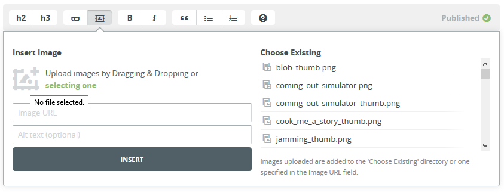

# Como criar um post novo

1. Entre no site [prose.io](www.prose.io)
2. Navegue até o seu repositório (rerapyo.github.io)
3. Selecione a pasta "\_posts"
4. Clique no botão "New File"
5. Escreva seu post normalmente.
6. Para adicionar imagens, você pode ou colocá-las diretamente na pasta `assets/images` ou adicioná-las usando o editor:

7.  Se quiser modificar o texto alternativo, que surge no mouse over da imagem, é só mudar o texto entre colchetes:

        

8.  Mude o nome do arquivo para algo único e significativo, mantendo a data e a extensão `md`. Exemplo: 2019-03-21-deconstructing-game-development.md
9.  Na coluna da direita, clique em "Meta Data"
10. Adicione uma ou mais categorias:

        categories: case-study

11. Adicione uma thumbnail:

        thumb: /assets/images/deconstructing_thumb.png

12. Se quiser modificar a data, é possível fazê-lo aqui, ao invés de mexer no nome do arquivo:

        date: '2019-03-14 13:28:05 -0300'

13. É possível adicionar um título também:

        title:  "Deconstructing game development in 10 steps"

14. Se já quiser publicar o post, adicione:

        published: true

15. Clique novamente no ícone de "Meta Data" na barra direita para fechar a edição dos metadados.

16. Clique no símbolo de disquete, na barra direita, para fazer o commit do post novo.

17. Prontinho! Seu post estará publicado!

# Formatação especial de imagens

As imagens são adicionadas no formato de Markdown

    

Mas é possível adicionar configurações especiais pras mesmas! Basta adicionar chaves francesas e a classe em questão, tal como no exemplo abaixo:

    {:class="half"}

Isso vai resultar na imagem do gatinho usando apenas metade do tamanho disponível. As classes disponíveis são:

    - half (50%)
    - third (33%)
    - small (não extende até a borda da tela)

É importante estruturar as coisas conforme esperado da tag, para não ter erros estranhos de layout. Exemplo:

    {:class="half"}
    {:class="half"}

Ou então:

    {:class="third"}
    {:class="third"}
    {:class="third"}
